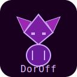

<p align="center">
  
</p>

# DoroLang 🚀

DoroLang - это простой, интерпретируемый язык программирования, созданный для образовательных целей. Он поставляется с собственной интегрированной средой разработки (IDE), что делает его идеальным инструментом для изучения основ программирования.

## ✨ Возможности

### Язык DoroLang
*   Простой и интуитивный синтаксис.
*   Переменные (`kas`), строки, числа и булевы значения (`true`/`false`).
*   Арифметические операторы (`+`, `-`, `*`, `/`, `%`).
*   Условные операторы `if-else` с блоками `{}`.
*   Операторы сравнения (`==`, `!=`, `<`, `>`, `<=`, `>=`).
*   Логические операторы (`and`, `or`, `not`).
*   Комментарии (`#`).
*   Автоматическое приведение типов при конкатенации строк.

### DoroLang IDE
*   Полнофункциональный редактор кода с подсветкой синтаксиса.
*   Нумерация строк.
*   Встроенная консоль для вывода результатов.
*   Горячие клавиши для быстрого запуска (F5) и сохранения (Ctrl+S).
*   Работа с файлами (`.doro`).
*   Кроссплатформенность (написана на Python/Tkinter).

## 🚀 Начало работы

### Требования
*   Python 3.6+

### Запуск IDE
Просто запустите файл `dorolang_ide.py`:
```bash
python dorolang_ide.py
```
Для полной функциональности убедитесь, что файлы `lexer.py`, `parser.py` и `interpreter.py` находятся в той же папке.

### Использование через командную строку
Вы также можете использовать DoroLang без IDE:
*   **Интерактивный режим (REPL):** 
  ```bash
  python main.py interactive
  ```
*   **Запуск файла:**
  ```bash
  python main.py my_program.doro
  ```

## 📚 Краткий справочник по синтаксису

### Переменные
```doro
kas message = "Hello, World!"
kas score = 100
kas is_ready = true
```

### Вывод в консоль
```doro
say "Your score is: " + score
```

### Комментарии
```doro
# Это однострочный комментарий
kas x = 10 # Это тоже комментарий
```

### Условные операторы
```doro
kas age = 18
if (age >= 18) {
  say "Доступ разрешен."
} else {
  say "Доступ запрещен."
}
```

## 💻 Пример программы

Вот пример программы, демонстрирующей основные возможности языка:

```doro
# =====================================
#  Мини-профиль RPG персонажа
# =====================================
say "Загрузка профиля персонажа..."
kas hero_name = "Dorofii the Brave"
kas health = 95.5
kas is_alive = true

# Проверяем, жив ли персонаж, а затем его состояние
if (is_alive == true) {
  say "Статус: Жив"
  # Вложенное условие для проверки здоровья
  if (health < 50) {
    say "Здоровье критически низкое! Нужно лечиться!"
  } else {
    say "Здоровье в норме."
  }
} else {
  say "Статус: Персонаж пал в бою."
}
say "============================="
say "Тесты завершены!"
```

## 👨‍💻 Автор
*   **Dorofii Karnaukh**